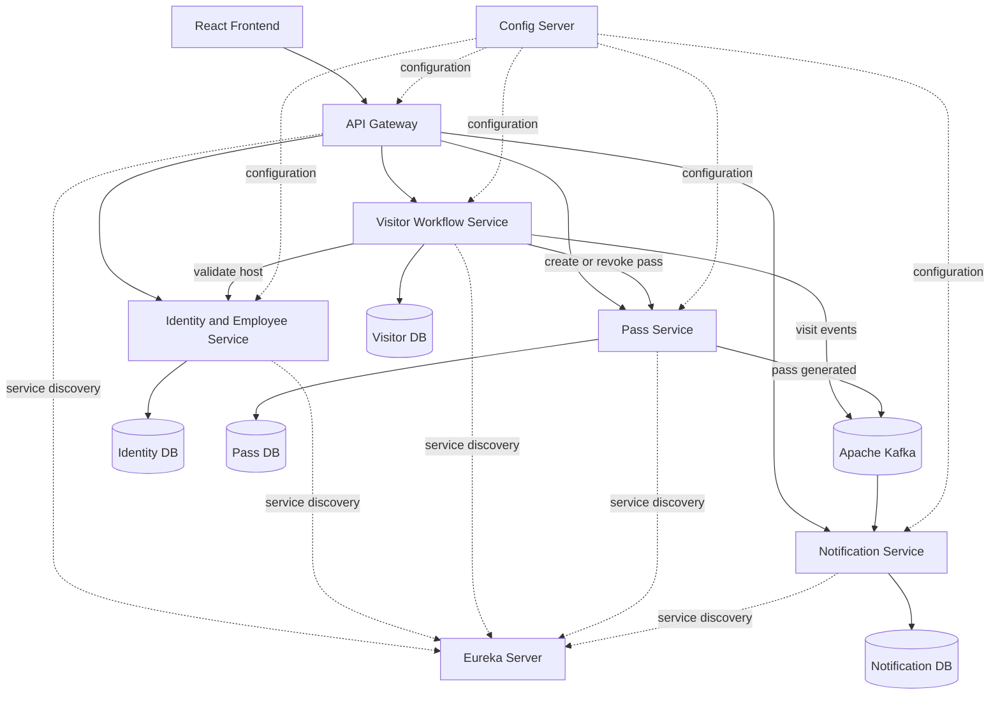

# Visitor FastPass

Visitor FastPass is a visitor management system for host-approved visits, secure QR passes, reception check-in/check-out, and auditable visit history.

It combines a React frontend with Spring Boot microservices. Visitors register without an account, hosts approve or reject requests, reception verifies the QR pass, and administrators monitor the complete workflow.

## Architecture



## Features

- Public visitor registration and status lookup
- JWT authentication with Admin, Host, and Reception roles
- Host approval and rejection workflow
- Secure digital QR passes
- Reception pass verification, check-in, and check-out
- Admin dashboard, visitor search, employee management, and notification history
- Kafka-based notification events with simulated email delivery for local development
- Swagger/OpenAPI documentation for each business service

## Technology

**Frontend:** React, Vite, Material UI, Formik, Yup, Axios

**Backend:** Java 17, Spring Boot, Spring Cloud Gateway, Eureka, Config Server, Spring Security, JWT, JPA, Flyway, OpenFeign, Kafka, MySQL

## Local development

### Prerequisites

- Java 17+
- MySQL on `localhost:3306` with `root/root`
- Kafka on `localhost:9092`
- Node.js 18+ and pnpm (or npm for the frontend)

### Start the backend

```powershell
.\mvnw.cmd clean test
.\scripts\start-all.ps1
```

The services use these ports:

| Application | Port |
|---|---:|
| API Gateway | 8080 |
| Identity & Employee Service | 8081 |
| Visitor Workflow Service | 8082 |
| Pass Service | 8083 |
| Notification Service | 8084 |
| Eureka Server | 8761 |
| Config Server | 8888 |

### Start the frontend

```powershell
cd frontend
pnpm install
pnpm dev
```

Open `http://localhost:5173`. The frontend defaults to `http://localhost:8080`; set `VITE_API_BASE_URL` in `frontend/.env` when using a deployed gateway.

Stop the backend with:

```powershell
.\scripts\stop-all.ps1
```

## Demo accounts

| Role | Username | Password |
|---|---|---|
| Admin | `admin` | `Admin@123` |
| Host | `asha.host` | `Host@123` |
| Reception | `reception` | `Reception@123` |

These bootstrap credentials are for local development only. Disable bootstrap and replace all secrets in any shared environment.

## Deployment

The frontend is a static Vite application and includes [Vercel configuration](frontend/vercel.json) for SPA routing. Create a Vercel project using `frontend` as the project root, set the build command to `pnpm build`, the output directory to `dist`, and define `VITE_API_BASE_URL` as the public URL of a deployed API Gateway.

The frontend cannot complete a public demo while `VITE_API_BASE_URL` points to `localhost`. The backend services, MySQL, Kafka, and gateway must be deployed separately, with CORS enabled for the frontend domain. The included [GitHub Actions workflow](.github/workflows/deploy-frontend.yml) can publish the frontend to GitHub Pages after the repository is pushed and its `VITE_API_BASE_URL` variable is configured.

## API highlights

```text
POST  /api/v1/auth/login
GET   /api/v1/public/hosts
POST  /api/v1/public/visits
GET   /api/v1/public/visits/status/{reference}
PATCH /api/v1/host/visits/{id}/approve
PATCH /api/v1/host/visits/{id}/reject
POST  /api/v1/reception/visits/check-in
POST  /api/v1/reception/visits/{id}/check-out
POST  /api/v1/reception/passes/verify
GET   /api/v1/admin/dashboard
```

## Project structure

```text
frontend/             React/Vite application
api-gateway/          Public API entry point
identity-service/     Authentication and employee management
visitor-service/      Visit lifecycle and approvals
pass-service/         QR pass generation and verification
notification-service/ Email notification workflow
discovery-server/     Eureka service registry
config-server/        Centralized configuration
scripts/              Local start and stop helpers
```

Planning documents are intentionally excluded from the public repository.
